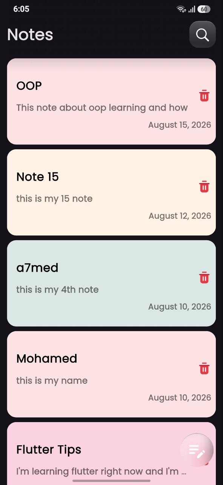
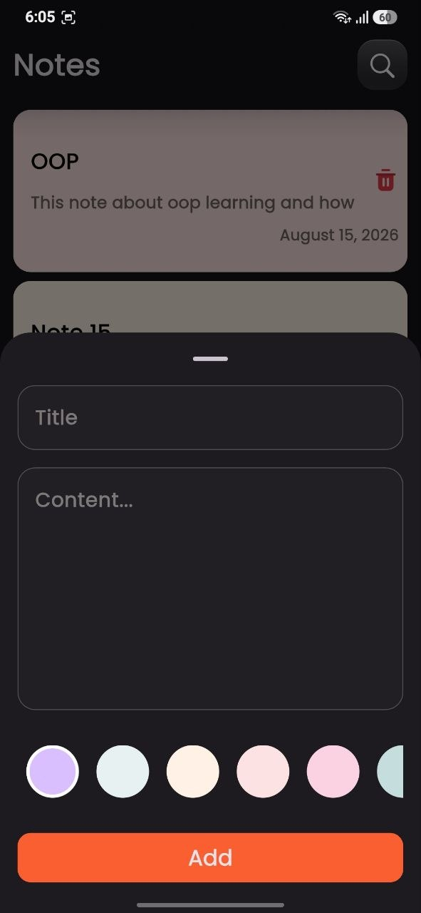
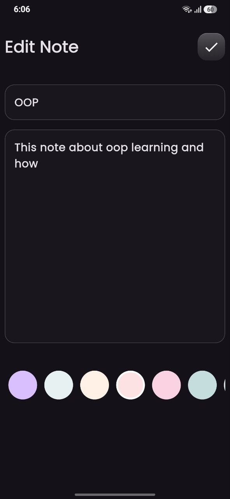
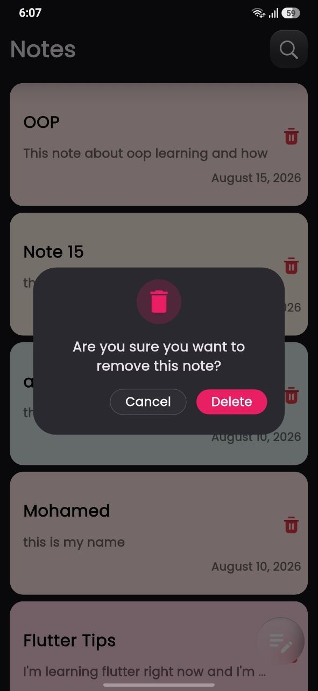
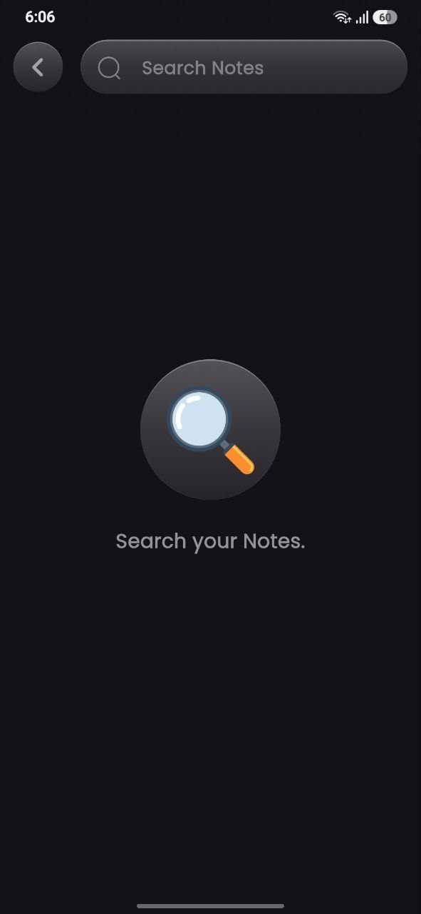
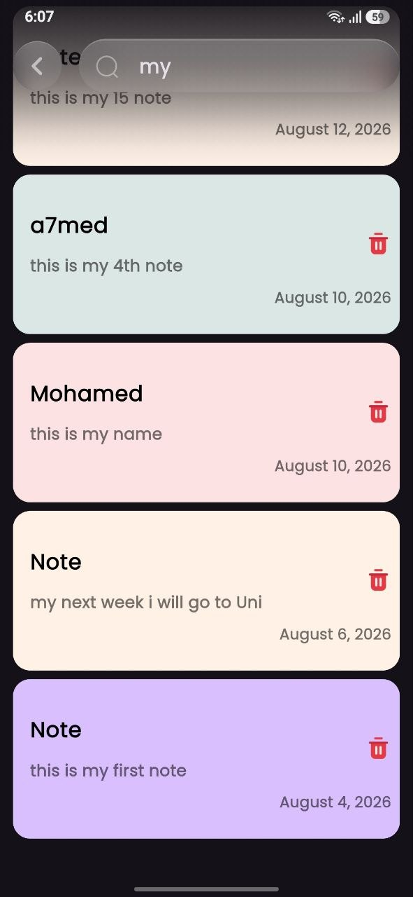
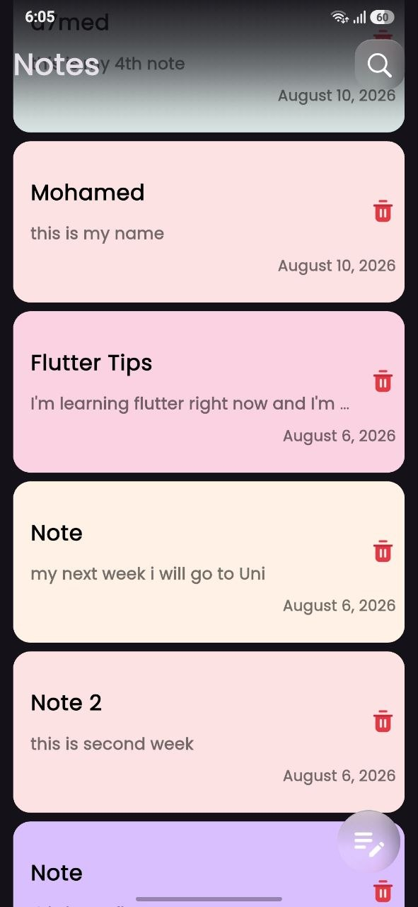

# 📝 Notely

A simple and modern **Flutter Notes App** built to make creating, organizing, and finding notes fast and easy.

Notely uses **Hive** for local data persistence, so your notes are stored directly on your device and remain available even without an internet connection.

## ✨ Features

* 📝 Create and save notes
* ✏️ Edit existing notes
* 🗑️ Delete notes
* 🔍 Search through notes
* 💾 Local data persistence using Hive
* ⚡ Fast and lightweight
* 🎨 Clean and modern UI
* 📱 Responsive Flutter UI

## 📱 Screens

### Home Screen

View all your saved notes in one place.

### Add / Edit Note

Create a new note or update an existing one with an easy-to-use editor.

### Search

Quickly find notes by searching through their content.

## 🛠️ Technologies Used

| Technology      | Purpose                       |
| --------------- | ----------------------------- |
| Flutter         | Cross-platform UI framework   |
| Dart            | Programming language          |
| Hive            | Local database                |
| Hive Flutter    | Flutter integration with Hive |
| Cubit / BLoC    | State management              |
| Material Design | UI components                 |


## 💾 Local Storage

Notely uses **Hive** to store notes locally.

This provides:

* Fast read/write operations
* Offline access
* Persistent data
* Lightweight local storage
* No external database or server required

## 🔍 Search

The app includes a search feature that allows users to quickly find notes without manually browsing through all saved notes.

The search works with the locally stored Hive data, keeping the experience fast and responsive.

## 🚀 Getting Started

### 1. Clone the repository

```bash
git clone https://github.com/YOUR_USERNAME/notely.git
```

### 2. Navigate to the project

```bash
cd notely
```

### 3. Install dependencies

```bash
flutter pub get
```

### 4. Run the application

```bash
flutter run
```

## 📦 Generate Hive Adapters

If the project uses Hive code generation, run:

```bash
dart run build_runner build --delete-conflicting-outputs
```

---

## 📸 Screenshots

| Home                                                   | Add note                                                  |
| ------------------------------------------------------ | --------------------------------------------------------- |
|                    |                         |

| Edit note                                              | Delete                                                    |
| ------------------------------------------------------ | --------------------------------------------------------- |
|                    |           |

| Search                                                 | Search(2)                                                 |
| ------------------------------------------------------ | --------------------------------------------------------- |
|                |                 |

| Search Not Found                                       | Home 2                                                    |
| ------------------------------------------------------ | --------------------------------------------------------- |
|             |                     |


---


## 🎯 Future Improvements

* [ ] Dark mode
* [ ] Note categories
* [ ] Favorite notes
* [ ] Pin important notes
* [ ] Note colors
* [ ] Sort notes by date
* [ ] Archive notes
* [ ] Cloud synchronization
* [ ] Firebase authentication
* [ ] Backup and restore

## 👨‍💻 Author

**Mohamed Taha**

Flutter Developer interested in building clean, scalable, and user-friendly mobile applications.

---

⭐ If you like this project, consider giving it a star!
